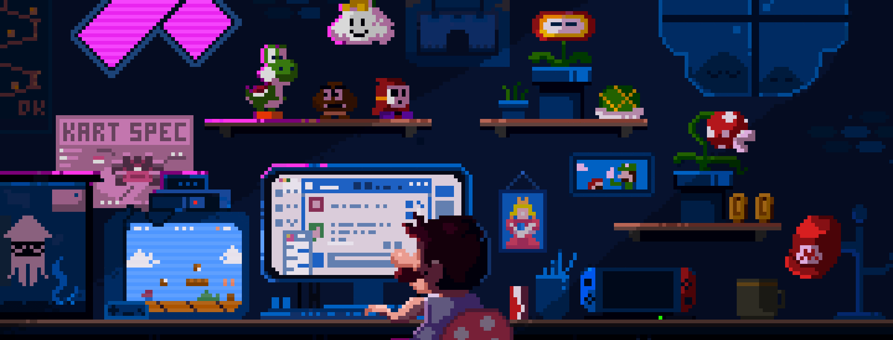
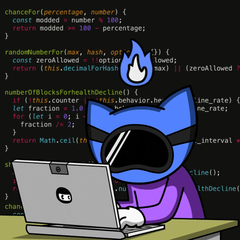

<h1 align="center">✨ WELCOME TO ✨</h1>

  
   
  
   

---

## 🚀 About Me
Hi there! I'm Muhammad Dzarel Alghifari — also known as DzarelDeveloper — a passionate Front-End Developer with a growing interest in Cybersecurity and Software Engineering.

I enjoy building responsive, user-friendly websites and solving tech challenges through code. My current focus is on front-end development using HTML, CSS, and JavaScript, while actively learning backend basics and secure coding practices.

🔧 Skills: HTML, CSS, JavaScript, Python (basic)  
🔐 Learning: Web Security, Ethical Hacking, Backend Development  
🎮 Hobbies: Gaming, side projects, and engaging with the tech community

Let's connect and create something impactful together!
---

<!-- Snake Animation - TOP ONLY -->

  

<!-- Profile Counters with Neon Effect -->

  
  
  

---

  

<!-- Animated Connector Lines -->

  

<!-- Social Links with GIF Side by Side -->

  <table style="border-collapse: collapse; margin: 20px auto;">
    <tr>
      <td style="padding: 20px; vertical-align: middle;">
        <!-- Party Animation GIF -->
        
      </td>
      <td style="padding: 20px; vertical-align: middle;">
        <!-- Social Links Table -->
        <table style="border-collapse: collapse;">
          <tr>
            <td style="padding: 8px;">
              
            </td>
            <td style="padding: 8px;">
              
            </td>
          </tr>
          <tr>
            <td style="padding: 8px;">
              
            </td>
            <td style="padding: 8px;">
              
            </td>
          </tr>
          <tr>
            <td colspan="2" style="padding: 8px; text-align: center;">
              
            </td>
          </tr>
        </table>
      </td>
    </tr>
  </table>

<!-- Call to Action -->

  

<!-- Decorative Footer -->

  

---

<h2 align="center">📊 My GitHub Stats</h2>

  
   
  
   
  

--- 

<h3 align="left">⚙️ Projects:</h3>

---

<h2 align="center">🌐 Connect with Me</h2>

  
  
  

  <h3>📈 Profile Stats</h3>
  

  

---

<h2 align="center">💖 Thanks for Visiting!</h2>
<!-- STATS -->
&nbsp;

    <h2 align='center'><i><a href="https://github.com/DzarelDeveloper">Activity Graph 📈</i></h2>
    

        
        
    

 
